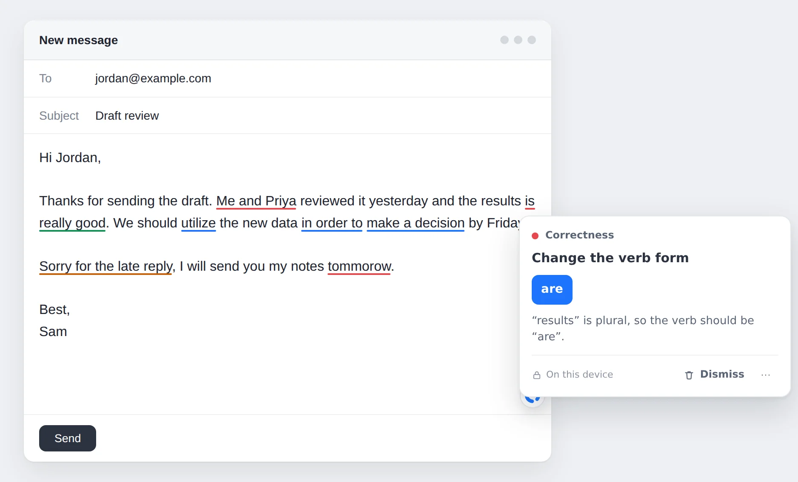
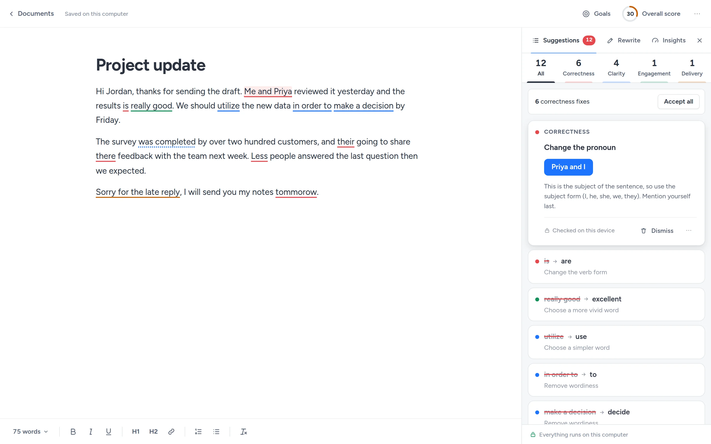

<p align="center">
  <picture>
    <source media="(prefers-color-scheme: dark)" srcset="assets/brand/oppenly-logo-on-dark.svg">
    
  </picture>
</p>

<p align="center">
  <strong>Grammar and writing help that stays on your computer.</strong><br>
  A free, open-source writing assistant for almost any website, and a document editor you run yourself.
</p>

<p align="center">
  <a href="https://github.com/shivashis-adhikari/Oppenly/actions/workflows/ci.yml"></a>
  <a href="LICENSE"></a>
</p>

<p align="center">
  <a href="https://shivashis-adhikari.github.io/Oppenly/">Website</a> ·
  <a href="#install">Install</a> ·
  <a href="#the-web-app">Web app</a> ·
  <a href="PRIVACY.md">Privacy</a> ·
  <a href="CONTRIBUTING.md">Contributing</a>
</p>

<p align="center">
  
</p>

## What it does

Oppenly underlines problems as you type in text boxes and rich-text editors, explains each one in
a sentence, and fixes it in one click. Suggestions come in four kinds:

| | Checks for | Example |
| --- | --- | --- |
| **Correctness** | Spelling, grammar, punctuation, verb forms, confused words | ~~the results is~~ the results are |
| **Clarity** | Wordy phrases, passive voice, hard-to-read sentences | ~~in order to~~ to |
| **Engagement** | Bland, overused and repeated words | ~~really good~~ excellent |
| **Delivery** | Tone, confidence, politeness, inclusive language | ~~Sorry for the late reply~~ Thank you for your patience |

It also has an assistant panel with every suggestion and "accept all" for correctness fixes,
rewrites of selected text, tone detection, an overall score, writing goals (audience, formality,
domain, intent), five varieties of English, and a personal dictionary.

## Why Oppenly

- **Private.** Checking runs in your browser with the [Harper](https://github.com/Automattic/harper)
  grammar engine and Oppenly's own style rules. No account, no servers, no analytics. It works
  offline.
- **Free, with no limits.** Nothing to buy. If you want AI suggestions, connect your own
  provider and pay it directly for what you use, or run a model on your computer.
- **Any AI, or none.** Ready-made settings for 17 providers, Chrome's built-in AI, Ollama,
  LM Studio and llama.cpp, plus any OpenAI-, Anthropic- or Gemini-compatible server.
- **Open.** Every line is here under the Apache 2.0 license, so the claims above can be checked.

## Install

### Chrome, Edge and Brave

1. Download `oppenly-<version>-chrome.zip` from the
   [latest release](https://github.com/shivashis-adhikari/Oppenly/releases/latest) and unzip it.
2. Open `chrome://extensions` (in Edge, `edge://extensions`) and turn on **Developer mode**.
3. Click **Load unpacked** and choose the unzipped folder.

A welcome page opens with a short demo. The Chrome Web Store listing is on its way; this section
will link to it once it is live.

### From source

Requires [Node.js](https://nodejs.org/) 22 and [pnpm](https://pnpm.io/installation) 10.

```sh
git clone https://github.com/shivashis-adhikari/Oppenly.git
cd Oppenly
pnpm install
pnpm build:extension
```

Then load `apps/extension/.output/chrome-mv3` with **Load unpacked** as above.

## The web app

<p align="center">
  
</p>

A full document editor with the same checks, goals, performance statistics, formatting, and
import and export for Word (`.docx`), OpenDocument (`.odt`), RTF, Markdown, HTML and plain text.
It is not hosted anywhere: you run it on your own computer, and your documents stay in your
browser.

```sh
git clone https://github.com/shivashis-adhikari/Oppenly.git
cd Oppenly
pnpm install
pnpm web
```

The first run builds the app. It then opens at http://localhost:4870. Keep using that address:
the browser stores your documents for it. Stop the app with Ctrl+C.

The page can only connect to that local server. If you connect a cloud AI provider, the server
forwards those requests to the provider for you, because browsers block most AI services from
being called directly by a web page. It listens only on your computer and keeps nothing.

## Using AI

AI is optional. Everything above works without it. Adding a provider gives context-aware
suggestions while you type, more rewrite options (improve, expand, persuasive, your own
instructions), writing from a prompt, and feedback such as predicted reader reactions.

1. Open Settings, then **AI providers**.
2. Pick a provider, paste your API key and agree to send text to it. Oppenly finds your available
   models and picks a fast one for live suggestions.

Keys are encrypted and stored only on your computer. Text goes straight to the provider you
chose, and only when an AI feature runs. [How the prompts work](docs/ai-prompts.md).

## Privacy

Oppenly does not collect anything. There are no servers, analytics, cookies or ads. Read the
[privacy policy](PRIVACY.md) for the details, including exactly what an AI provider receives if
you connect one.

## How it is built

```text
packages/engine   Writing engine: Harper (WebAssembly), style rules, tone, statistics,
                  score, local rewrites, and the optional AI layer
packages/ui       Design tokens, typeface, icons, shared components and settings screens
apps/extension    Browser extension (Manifest V3, WXT, Preact)
apps/web          Local web app (ProseMirror editor, engine in a Web Worker, local server)
apps/site         Website, product screenshots and store images
docs              Publishing guide and notes on the AI prompts
```

The extension checks text in a background worker and draws underlines in an isolated layer on
top of the page, without changing the page's own text until you accept a fix. The web app runs
the same engine in a Web Worker so typing never waits on a check.

## Limitations

- English only (American, British, Canadian, Australian and Indian).
- It does not work in Google Docs yet, or in desktop apps.
- Local checks catch common and medium-level mistakes well. Subtle, context-heavy errors are
  better caught with an AI provider connected.

## Contributing

Bug reports with the exact sentence that went wrong are the most useful contribution. See
[CONTRIBUTING.md](CONTRIBUTING.md) for setup, commands and the ground rules, and
[SECURITY.md](SECURITY.md) for reporting security problems privately.

## License

[Apache License 2.0](LICENSE). Third-party components and their licenses are listed in
[NOTICE](NOTICE). The Oppenly name and logo are covered by [TRADEMARKS.md](TRADEMARKS.md).

Oppenly is an independent project and is not affiliated with Grammarly or any AI provider.
